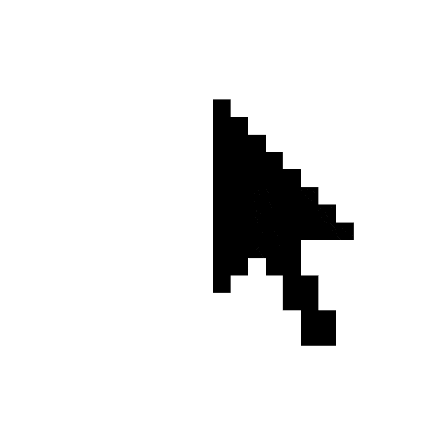

<!--
  hi 👋 you found my README source
-->

<!-- TOP HERO -->

  

 

---

## About Me

<table>
  <tr>
    <td width="38%" align="center">
      
    </td>
    <td width="62%">

I'm a CS student at **Wilfrid Laurier University** with a soft spot for **UX/UI design**. I like working on full-stack apps, experimenting with new tools, and figuring out how to make technical ideas feel simple and intuitive on the user side too. Most of my experience so far has come from personal projects, hackathons, coursework, and internships, where I've worked with modern web tech, APIs, and real-time systems.

You can usually catch me at hackathons and design events around **Waterloo and Toronto**. Outside of school, I'm building side projects, redesigning things for fun, testing new tools, or pushing random ideas a little too far just to see if they work.

Fun fact: I'm a huge anime nerd. I collect figures and manga like it's a full-time job!

  </td>
  </tr>
</table>

## Stack

<table>
  <tr>
    <td width="70%">

***Languages***

  
  
  
  
  
  
  
  
  

***Frontend***

  
  
  
  

***Backend & Databases***

  
  
  
  
  

***AI / APIs***

  
  
  

***Design & UX/UI***

  
  
  

***Tools & Workflow***

  
  
  
  
  
  

  </td>
    <td width="30%" align="center">
      
    </td>
  </tr>
</table>

---

## Connect

 
 

 

  

 

  thanks for stopping by 🖤

