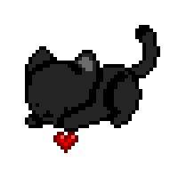

<!--
  hi 👋 you found my README source
  clean. intentional. human.
-->

<!-- TOP HERO -->

  

 

---

## About Me

<table>
  <tr>
    <td width="25%" align="center">
      
    </td>
    <td width="75%">

I’m **Manahil Bashir**, a **3rd-year Computer Science student** at **Wilfrid Laurier University**.

I enjoy building software that:
- feels **human**
- solves **real problems**
- stays **clean, deliberate, and accessible**

My interests sit at the intersection of **software engineering, thoughtful design, and AI-powered systems**.

  </td>
  </tr>
</table>

---

## Stack

  
  
  
  
  
  

  
  
  
  
  
  

  
  
  
  
  
  

---

## Selected Work

**My Auntie — AI Postpartum Support Companion**  
_TypeScript · Twilio · GPT APIs · MongoDB_  
An AI-powered phone + SMS companion providing empathetic, on-demand postpartum support.

**ShelfLife — Smart Pantry Management**  
_MERN · OCR · Python_  
Pantry tracking with expiry alerts, receipt scanning, and AI-assisted recipe suggestions.

**BetterWeb — Adaptive Accessibility Extension**  
_React · JavaScript · GPT APIs_  
A Chrome extension enabling AI-powered accessibility via natural language commands.

---

## Connect

<table>
  <tr>
    <td width="75%" align="center">

  </td>
    <td width="25%" align="center">
      
    </td>
  </tr>
</table>

---

  thanks for stopping by 🖤

